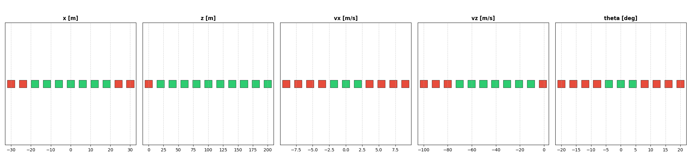
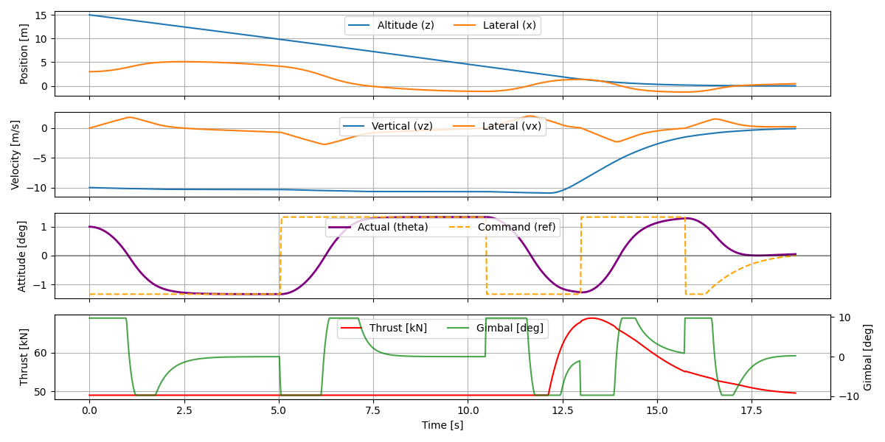
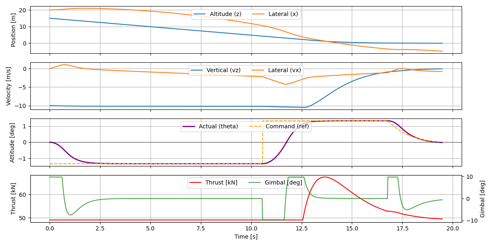
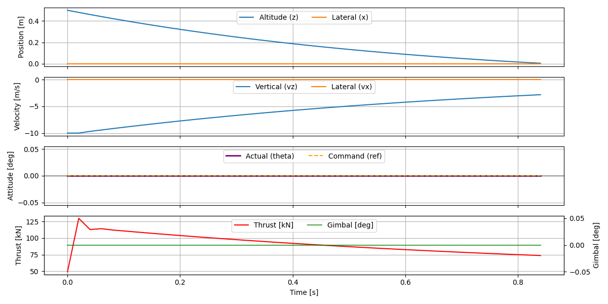
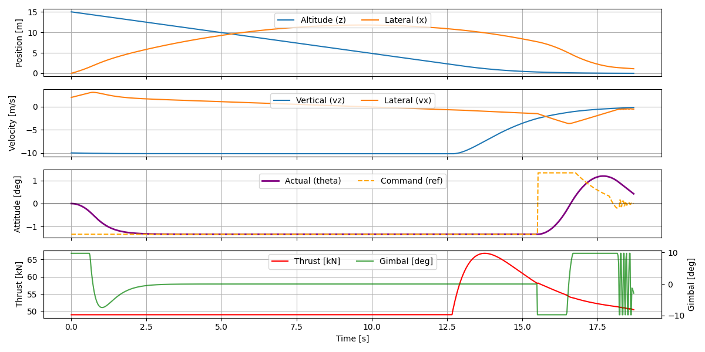
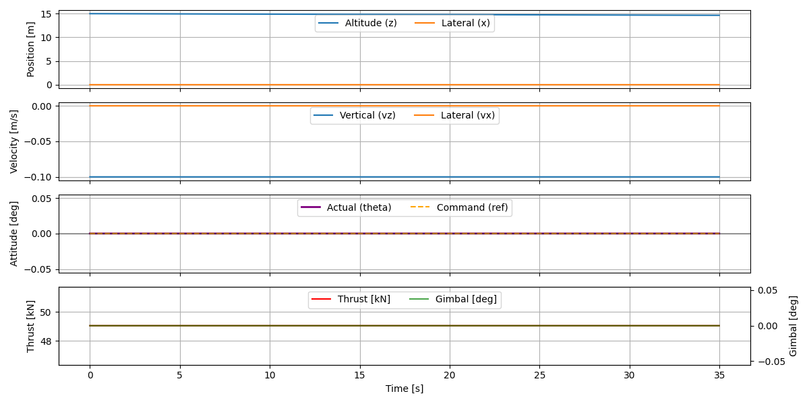
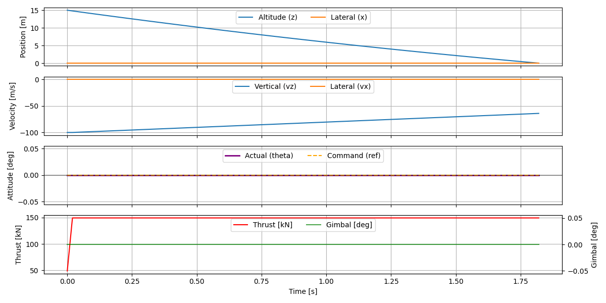
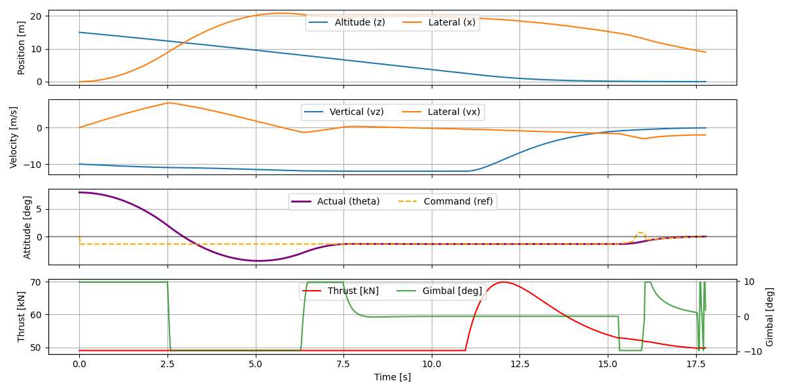
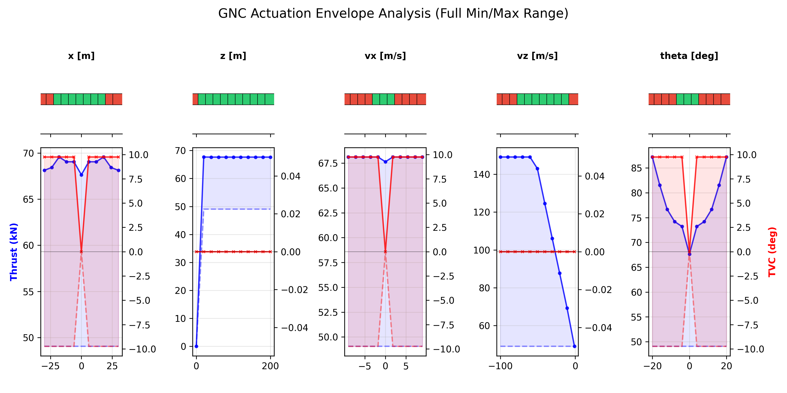
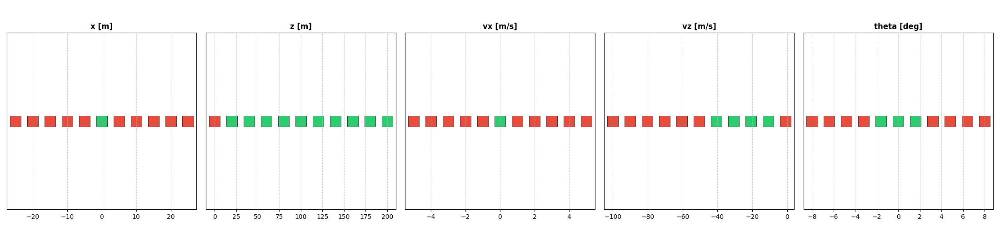

This document presents answers to the assignment questions.

# Session 2 - Problem formulation and modelling

## Question 1 - Formulate the equations of motion for this system and implement their time-based propagation.

### Coordinate Systems

The inertial frame is fixed at Earth surface, which is assumed to be non-accelerated and flat, with global Z axis pointing upwards and global X axis pointing to the right. 

The body frame has origin at the rocket Center of Mass (CM), with local Z' pointed upwards along the rocket frame axis and X' pointed to the rocket's right side. The rocket states are all referenced in the global frame.

### Equations
To derive the accelerations, we analyze the vector sum of forces in the inertial frame and the moments about the Center of Mass, considering a rigid body with constant linear and rotational inertias.

We employ Newton's 2nd law for each axis, considering that the only external forces are gravity and thrust (no aerodynamics) without misalignment between TVC and rocket local frame:

$$\ddot{z} = \frac{T}{m} \cos(\theta + \delta) - g$$
$$\ddot{x} = \frac{T}{m} \sin(\theta + \delta)$$

We can also employ Euler equation:
$$\ddot{\theta} = \frac{-T \cdot l}{J} \sin(\delta)$$

### State propagation
From the equations above, and using Euler integration, we derive the non-linear equations of motion and their time-based propagation in matrix form:
$$\frac{d}{dt} \begin{bmatrix} x \\ z \\ \theta \\ \dot{x} \\ \dot{z} \\ \dot{\theta} \end{bmatrix} = \begin{bmatrix} \dot{x} \\ \dot{z} \\ \dot{\theta} \\ \frac{T}{m} \sin(\theta + \delta) \\ \frac{T}{m} \cos(\theta + \delta) - g \\ -\frac{T \cdot l}{J} \sin(\delta) \end{bmatrix}$$

### Integrator
Time-propagation of state is non-linear for accuracy. Any further simplifications are reserved for controllers design only.

Time integrator should not be Euler to avoid numerical errors (ie: artificial non-conservation of energy). High accuracy integrators (Runge-Kutta 4th order) could be benefitial for a real application (eg: HILS), but for the present project we selected the second-order Heun's method as a balance between simplicity, computational speed and accuracy.

The plant (ie: rocket model) equations and integrator are implemented in the `model` folder.

## Question 2 - Demonstrate your modelling works as expected on an example case.

To verify the fidelity of the 3-DOF rocket model and the integration scheme, the simulation is subjected to four distinct unit test cases. These tests ensure that:
- the translational and rotational dynamics correctly propagate the rocket's states;
- the translational dynamics are uncoupled;
- the rotational dynamics is correctly coupled with translational; and
- that the integrator does not introduces considerable numerical error.

Such tests are available for run:
```
pytest tests/test_physics.py
```

# Session 3 - Algorithm Implementation

## Question 3 - Implement an algorithm of your choice that can steer the rocket towards the given landing point and that meets the requirements. Explanations on the choice of controller architecture and gains are expected.

### Controller Architecture
Options:
- PID: simple SISO, but coupled dynamics requires nested loops;
- LQR: complete MIMO, but more complex and also requires linearization;
- MPC: handles non-linearities (ie: TVC gimbal saturation), but too complex and computationally expensive.

We choose PID for simplicity. More specifically, we implement 3 loops:
- Attitude controller (inner faster loop) that manages the TVC gimbal $\delta$ to maintain the commanded pitch $\theta_{cmd}$, tuned for higher bandwidth.

- Position controller (outer slower loop) that looks at the lateral error $x_e$ and commands a tilt angle $\theta_{cmd}$ to steer the rocket, tuned for lower bandwidth.

- Altitude controller (independent loop): A PID controller that manages Thrust $T$ to track a descent profile, ensuring we hit $z=0$ with $v_z \approx 0$.

This architecture is sensitive to model plant mismatch. Therefore, we should not expect good performance in extreme scenarios (ie: high attitude angle $\theta$, obstacle avoidance).

Also, there is a risk of resonance and instability due to: true coupling of attitude and altitude, which are assumed to be decoupled in this architecture; and sensors/actuators limitations (ie: saturation, delay due to latency or inertia).

### Gains Design
As a preliminary gain selection:
- Attitude PD controller must have high bandwidth, so we prioritize high $K_p$ for $\theta$ and a strong $K_d$ to dampen oscillations. $K_i$ should be null because we assume no torque disturbances (ie: aerodinamics, CM offsets).

- Position PD controller must be significantly slower than the inner loop (usually by a factor of 5–10) to prevent the two loops from "fighting" each other and causing instability. Also, $K_i$ should be null to avoid coupling with attitude controller, and because there is no lateral speed of the target landing position and no aerodynamic disturbances.

- Altitude PD controller can have less bandwidth since its dynamic is slower. $K_i$ is null to avoid windup, and also because the landing target is not moving vertically and there is no aerodynamic disturbances. It will comprise of PID control plus feedforward for gravity compensation $T_{hover} \approx mg$.

This way, Altitude controller handles the gravity, while the nested Position/Attitude controllers handle the position similar to the "Inverted Pendulum" problem.

Calculating the theoretical gains for the attitude controller, we first assume that torque is linear for small $\delta$. Then, appliying this assumption on 2nd order closed-loop equation:

### Theoretical Gain Derivation
Initial gains were derived by linearizing the plant dynamics and applying pole placement for a desired natural frequency $\omega_n$ and damping ratio $\zeta$.

#### Altitude Controller (Vertical Loop)
The vertical dynamics $m\ddot{z} = T - mg$ are controlled via feedforward + PD architecture: $T = mg + K_{p,z}e_z + K_{d,z}\dot{e}_z$:
* **$K_{p,z} = m \cdot \omega_n^2$**
* **$K_{d,z} = 2 \zeta \omega_n \cdot m$**
* **$K_{i,z} = 0$**
* $\omega_n$: $1.0$ rad/s
* $\zeta$: $1.0$ (critically damped)

#### Position Controller (Outer Loop)
Translates lateral error into a tilt command. Since $a_x \approx g \cdot \theta$:
* **$K_{p,x} = \frac{\omega_n^2}{g}$**
* **$K_{d,x} = \frac{2 \zeta \omega_n}{g}$**
* **$K_{i,x} = 0$**
* $\omega_n$: $0.7$ rad/s (5.7x frequency separation from attitude controller)
* $\zeta$: $1.2$ (overdamped)

#### Attitude Controller (Inner Loop)
The linearized rotational dynamics are governed by $J\ddot{\theta} = -(T \cdot l) \cdot \delta$. Using a PD law $\delta = K_{p,\theta}\theta + K_{d,\theta}\dot{\theta}$:
* **$K_{p,\theta} = \frac{J \cdot \omega_n^2}{T \cdot l}$**
* **$K_{d,\theta} = \frac{2 \zeta \omega_n \cdot J}{T \cdot l}$**
* **$K_{d,\theta} = 0$**
* $\omega_n$: $4.0$ rad/s (fast response)
* $\zeta$: $0.8$ (underdamped)

Autopilot (rocket steering) implementation is found in `control` folder.

Notes:
* **Frequency Separation:** The inner loop is tuned to be faster than the outter loop to ensure stability and prevent resonance.
* **Integrator Anti-Windup:** Not required as all integrator gains are null in our controllers.
* **Small-Angle Approximation:** The controller assumes $|\theta| < 20^\circ$ to maintain TVC linearity.

# Session 4 - Robustness and sensitivity analyses
## Question 4 - How much can the set of initial conditions be expanded while still be able to land within the requirements? E.g. how much further away can you initiate the powered descent? At which speed? With which tilt angle? Discuss.
### OAT Grid Search
One-At-a-Time (OAT) Grid Search is performed over the initial state parameters to quickly verify how much the envelope can be expanded from the nominal initial states, for each state in separate:


For reference during the following subsections, here is an example of successfull flight:


> PS: the altitude $z$ is presented in all plots as divided by 10 so it can be seen in similar order of magnitude as lateral position $x$.

### Initial x
After 17 meters horizontally away from the target position, $x$ and $\dot{x}$ finish with lateral translation still in progress. It looks like there is more opportunity for improvement by increasing hovering time, though:


### Initial z
Initial altitude can start as low as 25 meters. Lower than this does not allow time for the altitude controller to avoid collision given the initial vertical speed of -10m/s. This envelope can hardly be improved, though it does not seem to be necesary for a realistic CONOPS:


### Initial vx
Lateral velocity must start up to 2 m/s. After this figure, there is an oscillation in the gimbal caused by the Altitude controller, and a premature flight ending. This indicates that there may be room for improvement if successfully solving a potential resonance with attitude controller:


### Initial vz
High initial vertical velocity (ie: -1 m/s) takes too long for a landing. This issue can likely be solved by adjusting the gravity-feedforward in altitude control which is currenly not accounting for a very low vertical speed (or implementing a more sophisiticated state machine for different flight phases):


On the other extreme, descending speed greater than -70 /s cannot be compensanted within enough time, leading to collision. This could be addressed if we had higher thrust:


### Initial theta
Attitude must start up to 5 degrees tilted. Otherwise, it manages to estabilize only the attitude control but not enough time to handle the position control. Again, it looks like there is room for improvement if we change the virtual gates to delay landing by hovering for a while until the slower outter loop is also estabilized:


All conclusions above are not extensive, as they lack combination of multiple initial states disturbances and finer granularity. In such case, Monte Carlo simulation would be more appropriate, though it would be a bit harder to show the influence of each initial state disturbance on the valid envelope boundaries.

## Question 5 - What are the key limiting factors preventing the controller to land the rocket with a larger subset of initial states, or a better accuracy? What type of Guidance and Control (G&C) architecture would be better?

As discussed in the previous question 4, there are 3 limiting factors observed at the extremities of the envelope:

1 - The landing event sometimes happen unnecessarially early (ie: 17.5 seconds when it could be up to 35 seconds). Such waste of potential flight time could be used to hover a few meters above the ground and have enough time to estabilize other parameters that have not yet met the requirements (usually lateral position and lateral velocity). Such new feature ("Terminal Guidance") could be achieved by creating a more sophisiticated state machine that could adding virtual gates by changing the vertical target position based on the rocket current state.

2 - The feedforward gravity for altitude control is not considering the possibility of the initial vertical speed be too slow. A correction could be implemented by adding an initial shorter controller that decreases the hover thrust in order to achieve a target vertical descendent speed. This could also be managed by a machine state as suggested in the previous bullet point. The combination of points 1 and 2 would lead to change the controllers from reactive to proactive approach ("Powered Descent Guidance").

3 - Oscillations in the TVC gimbal command, is sometimes observed in some situations. This usually happen when aggressive corrections are required involving large $\theta_{cmd}$, which causes coupling issues between the attitude and position controllers. It is also caused by a momentary lateral force in the opposite direction where the lateral displacement is commanded due to the TVC dynamics:

  - Some manual tuning of the position controller was performed in order to decrease such coupling, but more extensive work on this could improve lead to improved performance (perhaps with automated gain optimization techniques).

  - Passing $\theta_{cmd}$ through a 2nd order lead-lag filter could also help to avoid abrupt command changes.

  - Gain scheduling could also help by setting more aggressive gains at the beginning and smaller gains at the terminal phase to avoid such oscillations.

  - Complete change of GNC architecture could also be helpful. By considering LQR or MPC, all the issues reported above (ie: non-linearities, coupling) and even a custom cost function could be incorporated into the controller capabilities, potentially resulting in overall improved performance. However, such approaches are more complex to design.

# Session 5 - Actuators and sensors requirements
## Question 6 - Derive and justify reasonable requirements for TVC min/max angles and Thrust min/max value.

The grid search from the previous session was repeated, but this time adding the plot of minimum and maximum control commands:


From the plot above, and considering only the nominal conditions from "3.2 Requirements", we conclude that our current GNC architecture requires:
 - thrust between 48 and 74 kN; and
 - TVC angles between -10 and 10 degrees.

Such thrust requirement results in thrust ratio of 1.5 ($ \approx 74 kN / (5.0e3 kg \times 9.81 m/s^2)$). This is very achievable considering that other similar rockets are usually between 1.5 and 2.0 thrust ratio.

Regarding TVC angles, this is also reasonable considering that other similar rockets are usually between 5 to 15 degrees of gimbal range.

Again, all conclusions above are not extensive, as they lack combination of multiple initial states disturbances and finer granularity. In such case, Monte Carlo simulation would be more appropriate.

## Question 7 - Implement those limits in your modelling and show how much this impacts your landing performance.

The answer to the previous question approached both sides at the same time: comparison with other similar rockets and assessment of controls envelopes from our rocket simulation. Therefore, the TVC and Thrust requirements detailed in the previous question have no impact on the landing performance within the nominal scenarios.

For the sake of exercise, the OTA-grid-search is executed again but limiting the TVC gimbal to +-5 degrees and maximum thurst to 60 kN:


The result is that the envelope of successfull landings has reduced across almost all parameters. This shows that the requirements from the previous question 6 are rather crucial for the success of this CONOPS. This was expected since the TVC is often used at their limits of +- 10 degrees.

## Question 8 - Break down the different state variables and give examples of sensors that could be used, or alternatively examples of indirect observation method that would provide suitable estimates.

All state variables have observability thanks to these sensors:
- $\dot{\theta}$ from gyroscope (ie: IMU).
- $\theta$, $\dot{x}$, $\dot{z}$ from inertial navigation system (INS).
- $x$, $z$ from aided navigation system (ie: KF).

The aided navigation system should combine high-frequency sensors (IMU) and low-frequency sensors (ie: GPS, baroaltimeter, LiDAR) in a state estimator (KF) for best accuracy. EKF might be chosen over KF if non-linearity is found to play a relevant role in errors propagation of time extrapolation. Also, transfer alignment might be considered for misalignment estimation, achieving better accuracy during longer non-aided periods (ie: without GPS and LiDAR).

In a real application, further discussions should consider lever-arm (sensors away from CM), structural deformations (ie: bending, torsion, flutter, vibrations, misalignments) and operational conditions (ie: thermal cycles on influencing bias drift, different altitudes influencing GPS accuracy).

The result should be a high-frequency optimal state estimator with reduced bias drift after proper tuning.

Regarding the control states, the are measured separetely:
- $\delta$ using LVDT, RVDT, potentiometers, encoders or actuator current.
- $T$ measuring combustion chamber pressure transducer, liquid fuel consumption or even IMU (since there is aerodynamical forces and constant mass value is well known then there is only gravity and thrust, otherwise ignore IMU).

## Question 9 - Re-implement the control algorithm you developed in section 3 but this time in C++. Additional tips and constraints for this C++ version: you should use an object-oriented approach; think about methods, encapsulation, maintainability, testability; your implementation needs to satisfy all constraints you deem necessary to successfully and safely run on an embedded flight computer: list them.

The Python code was reimplemented in C++17 using an object-oriented designed for high reliability embedded environment. The source code is available at `src\embedded`.

Applied Embedded Constraints & Safety Features:

- **Encapsulation**: avoiding arrays in favor of structs, defining constants when applicable and keeping internal variables as private;

- **Static Memory Allocation**: no `new`, `malloc`, or standard containers like `std::vector` that grow dynamically to avoid non-deterministic timing and bad memory access.

- **Floating Point Consistency**: using same float (32-bit) instead of double (64-bit) consistently across all variables for higher hardware compatibility.

- **Temporal Determinism**: fixed-step execution (dt) designed to run in a deterministic loop (e.g., a 100Hz task) without timing jitter.

- **No Exceptions**: use of `noexcept` ensuring the code is noexcept so the GNC never crashes in flight due to unhandled exception.

- **Anti-Windup**: not necesasry as we haven't used the Integrator in PID.

- **Actuator Saturation**: every PID has strict output limits to prevent invalid commands to actuators.

- **Numerical Safety**: protection against division-by-zero.

- **Namespace Protection**: wrap GNC code in a namespace (eg: `RocketLab::GNC`) to avoid naming collisions with other libraries.

- **Automated Verification**: following test-driven development approach, integrated GoogleTest for Continuous Integration mindset, allowing automated regression testing and naturally contributing towards a future Built-In-Test library.

- **Robustness**: PID state reset capability, should in the future a multi-phase flight transition be implemented.

Opportunities for improvement:
- Optimization: further definitions for compile could decrease overhead, such as disabling exceptions.

## Question 10 - Write unit tests and provide proof showing that your C++ implementation is performing as expected, matching your MATLAB/Python implementation.

The C++ source code contain unit tests are available at `src/embedded/tests`. They can be executed by:
```
./build/run_gnc_tests.exe
```

Alternatively, it can also be executed by:
```
cd build/
ctest.exe
```